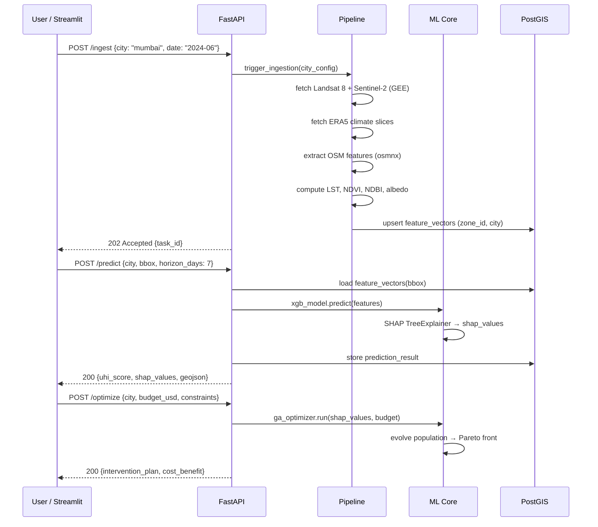
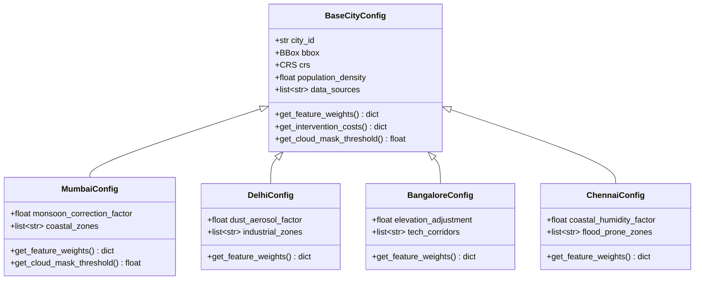
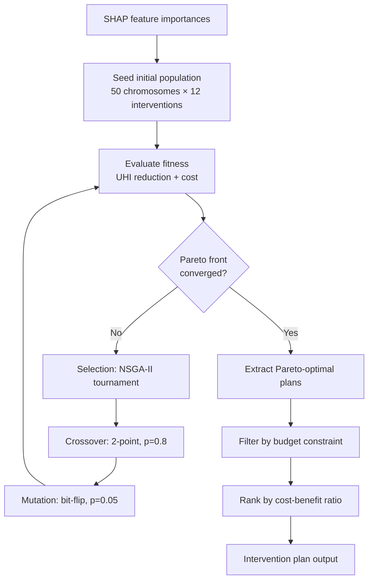
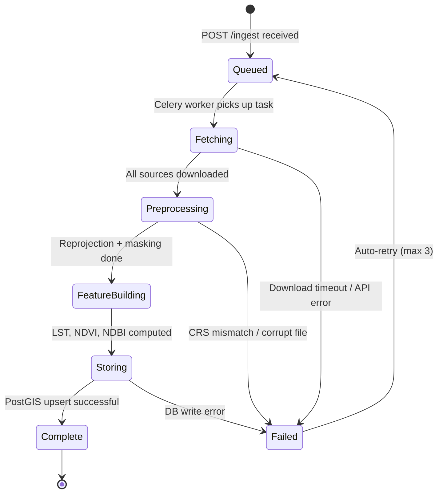

# Urban Heat Mitigation Platform (UHMP) — Architecture Reference

> **Version:** 1.0  
> **Case study:** Mumbai  
> **Generalisable to:** Any city with Landsat 8 / Sentinel-2 / ERA5 / OSM coverage  
> **Stack:** XGBoost · SHAP · Genetic Algorithm · FastAPI · Streamlit

---

## Table of contents

1. [Component architecture](#1-component-architecture)
2. [Data flow architecture](#2-data-flow-architecture)
3. [API architecture](#3-api-architecture)
4. [Mermaid diagrams](#4-mermaid-diagrams)
5. [Recommended folder structure](#5-recommended-folder-structure)
6. [Key design decisions](#6-key-design-decisions)

---

## 1. Component architecture

The platform is organised into five horizontal layers. Each layer is independently deployable and city-agnostic by design.

```
┌─────────────────────────────────────────────────────────────────────┐
│  LAYER 0 — DATA SOURCES                                             │
│  Landsat 8 · Sentinel-2 · ERA5 (climate) · OpenStreetMap · IoT     │
└───────────────────────────┬─────────────────────────────────────────┘
                            ▼
┌─────────────────────────────────────────────────────────────────────┐
│  LAYER 1 — INGESTION & PREPROCESSING                                │
│  ┌──────────────┐  ┌──────────────┐  ┌──────────────┐  ┌────────┐ │
│  │ Satellite    │  │ Climate      │  │ OSM          │  │Feature │ │
│  │ fetcher      │  │ fetcher      │  │ extractor    │  │builder │ │
│  │ GEE/direct   │  │ ERA5 CDS API │  │ Overpass /   │  │LST,    │ │
│  │ download     │  │              │  │ osmnx        │  │NDVI,   │ │
│  │              │  │              │  │              │  │NDBI    │ │
│  └──────────────┘  └──────────────┘  └──────────────┘  └────────┘ │
└───────────────────────────┬─────────────────────────────────────────┘
                            ▼
┌─────────────────────────────────────────────────────────────────────┐
│  LAYER 2 — ML CORE                                                  │
│  ┌──────────────┐  ┌──────────────┐  ┌──────────────┐  ┌────────┐ │
│  │ XGBoost      │  │ SHAP         │  │ GA           │  │ City   │ │
│  │ predictor    │  │ explainer    │  │ optimizer    │  │ adapter│ │
│  │ UHI index +  │  │ Global +     │  │ Green cover, │  │Pluggable│ │
│  │ temp forecast│  │ local feat.  │  │ albedo, mix  │  │ configs│ │
│  │              │  │ importance   │  │              │  │        │ │
│  └──────────────┘  └──────────────┘  └──────────────┘  └────────┘ │
└───────────────────────────┬─────────────────────────────────────────┘
                            ▼
┌─────────────────────────────────────────────────────────────────────┐
│  LAYER 3 — FASTAPI BACKEND                                          │
│  /predict  ·  /explain  ·  /optimize  ·  /ingest  ·  /cities       │
└───────────────────────────┬─────────────────────────────────────────┘
                            ▼
┌─────────────────────────────────────────────────────────────────────┐
│  LAYER 4 — STREAMLIT FRONTEND                                       │
│  Heat map view · SHAP dashboard · Optimization panel · City selector│
└─────────────────────────────────────────────────────────────────────┘
```

### Layer breakdown

| Layer | Responsibility | Key technologies |
|-------|---------------|-----------------|
| Data sources | Raw satellite, climate, and urban data | Landsat 8, Sentinel-2, ERA5, OSM, IoT sensors |
| Ingestion & preprocessing | Download, reproject, cloud-mask, spatial join, normalise | Google Earth Engine, CDS API, osmnx, rasterio |
| ML core | Predict UHI, explain drivers, optimise interventions | XGBoost, SHAP, DEAP (genetic algorithm) |
| FastAPI backend | RESTful async API, auth, caching, task queue | FastAPI, Pydantic, Celery, Redis |
| Streamlit frontend | Interactive maps, SHAP visualisations, Pareto charts | Streamlit, Folium, Plotly, Altair |

---

## 2. Data flow architecture

Raw bytes from four satellite/climate sources are transformed into actionable urban heat mitigation plans through seven sequential stages.

```
① RAW INPUTS          ② PREPROCESS       ③ FEATURES
┌────────────┐        ┌─────────────┐    ┌─────────────────┐
│ Landsat 8  │──┐     │             │    │ LST (°C)        │
│ Band 10    │  │     │ Reprojection│    │ NDVI            │
├────────────┤  ├────▶│ Cloud mask  │───▶│ NDBI            │
│ Sentinel-2 │  │     │ Spatial join│    │ Albedo          │
│ NDVI bands │  │     │ Normalise   │    │ Population dens.│
├────────────┤  │     └─────────────┘    │ Road density    │
│ ERA5       │  │                        └────────┬────────┘
│ 2m temp    │──┤                                 │
├────────────┤  │                                 ▼
│ OSM        │──┘           ④ PREDICT        ⑤ EXPLAIN
│ Roads/bldg │         ┌──────────────┐    ┌──────────────┐
└────────────┘         │  XGBoost     │───▶│ SHAP         │
                       │  UHI score   │    │ Feature      │
                       └──────┬───────┘    │ contributions│
                              │            └──────┬───────┘
                              └──────┬────────────┘
                                     ▼
                   ⑥ OPTIMIZE              ⑦ OUTPUT
              ┌────────────────┐    ┌────────────────────┐
              │ GA optimizer   │───▶│ Intervention plan  │
              │ Budget-aware   │    │ Trees, cool roofs, │
              │ Pareto search  │    │ parks, wetlands    │
              └────────────────┘    └────────────────────┘
                     ▲
              ┌──────┴──────┐
              │ City config │
              │ Mumbai /    │
              │ generic     │
              └─────────────┘
```

### Stage-by-stage description

**Stage 1 — Raw inputs**

| Source | Data acquired | Resolution |
|--------|--------------|------------|
| Landsat 8 | Band 10 (thermal infrared) | 100 m resampled to 30 m |
| Sentinel-2 | Bands B4, B8, B11 (NDVI, NDBI) | 10–20 m |
| ERA5 | 2 m temperature, relative humidity, wind speed | 0.25° (~28 km) |
| OpenStreetMap | Roads, buildings, green areas, water bodies | Vector |

**Stage 2 — Preprocessing**

- Reproject all rasters to a common CRS (WGS84 / UTM zone per city)
- Cloud-mask Landsat and Sentinel imagery using QA bands (Mumbai: monsoon-aware threshold June–September)
- Spatial join vector OSM features onto the raster grid
- Normalise all features to zero mean, unit variance per city

**Stage 3 — Feature store**

Final feature vector per 30 m grid cell stored in PostGIS:

```
zone_id  | city   | lst_c | ndvi  | ndbi  | albedo | pop_density | road_density | timestamp
---------|--------|-------|-------|-------|--------|-------------|--------------|----------
MUM-0001 | mumbai | 38.4  | 0.12  | 0.34  | 0.18   | 42000       | 0.67         | 2024-06-15
```

**Stage 4 — XGBoost prediction**

Input feature vector → UHI intensity score (0–10) + 7-day temperature forecast per zone.  
Model trained on 5 years of Mumbai historical data; retrained quarterly via scheduled Celery task.

**Stage 5 — SHAP explanation**

`TreeExplainer` runs on every prediction. Outputs:
- **Global importance:** ranked feature bar chart across all zones
- **Local importance:** per-zone waterfall plot showing which features drove that zone's UHI score

**Stage 6 — GA optimisation**

Genetic algorithm (DEAP library) with:
- **Chromosome:** binary encoding of 12 intervention types (tree planting, cool roofs, reflective pavements, urban wetlands, etc.)
- **Fitness:** multi-objective — minimise UHI score reduction cost, maximise cooling benefit
- **Seeding:** top-5 SHAP features used to bias initial population toward high-impact interventions
- **Output:** Pareto-optimal front of intervention mixes within budget constraint

**Stage 7 — Intervention plan**

Ranked list of interventions per zone with estimated cost (USD), UHI reduction (°C), implementation timeline, and co-benefits (carbon, biodiversity score).

---

## 3. API architecture

### Middleware stack

```
Incoming request
      │
      ▼
┌─────────────────────────────────────────┐
│  CORS middleware                        │
├─────────────────────────────────────────┤
│  Rate limiting  (slowapi, 100 req/min)  │
├─────────────────────────────────────────┤
│  JWT authentication                     │
├─────────────────────────────────────────┤
│  Request / response logging             │
├─────────────────────────────────────────┤
│  GZip compression                       │
└──────────────────┬──────────────────────┘
                   ▼
          FastAPI application
```

### Route reference

| Method | Route | Request body | Response |
|--------|-------|-------------|----------|
| `POST` | `/api/v1/predict` | `{city, bbox, horizon_days}` | `{uhi_score, geojson, shap_summary}` |
| `POST` | `/api/v1/explain` | `{city, zone_id}` | `{shap_values, waterfall_data}` |
| `POST` | `/api/v1/optimize` | `{city, budget_usd, constraints}` | `{intervention_plan, pareto_front}` |
| `POST` | `/api/v1/ingest` | `{city, date_range}` | `{task_id}` (202 Accepted) |
| `GET`  | `/api/v1/cities` | — | `[{city_id, name, bbox, crs}]` |
| `GET`  | `/api/v1/task/{task_id}` | — | `{status, progress, result}` |

### Dependency injection

```
FastAPI app
├── ModelService          → loads XGBoost model + SHAP explainer on startup
├── DataService           → reads/writes PostGIS feature store
├── OptimizerService      → manages DEAP GA runner (async)
├── CityRegistry          → loads city YAML configs at startup
└── CacheService          → Redis TTL layer (predictions cached 1 h)
```

### Persistence layer

```
PostgreSQL + PostGIS        Redis                  S3-compatible store
─────────────────────       ─────────────────────  ─────────────────────
feature_vectors table       prediction cache        Raw GeoTIFF archives
prediction_results table    task status             Model artifacts
intervention_plans table    session tokens          SHAP value exports
city_configs table
```

### Example request / response

```python
# POST /api/v1/predict
{
  "city": "mumbai",
  "bbox": [72.77, 18.89, 72.99, 19.27],
  "horizon_days": 7
}

# 200 OK
{
  "city": "mumbai",
  "uhi_score": 7.4,
  "predicted_temp_c": 39.1,
  "geojson": { "type": "FeatureCollection", "features": [...] },
  "shap_summary": {
    "top_features": [
      { "feature": "ndvi",         "importance": 0.38 },
      { "feature": "albedo",       "importance": 0.27 },
      { "feature": "road_density", "importance": 0.18 }
    ]
  },
  "cached": false,
  "generated_at": "2024-06-15T10:32:00Z"
}
```

---

## 4. Mermaid diagrams

### 4.1 End-to-end pipeline sequence



### 4.2 City adapter class hierarchy



### 4.3 GA optimisation flow



### 4.4 Data ingestion state machine



---

## 5. Recommended folder structure

```
uhmp/
│
├── config/
│   ├── base_city_config.py          # Abstract CityConfig base class
│   ├── cities/
│   │   ├── mumbai.yaml              # Mumbai-specific params & weights
│   │   ├── delhi.yaml
│   │   ├── bangalore.yaml
│   │   └── chennai.yaml
│   └── settings.py                  # Env vars (DB, Redis, GEE creds)
│
├── ingestion/
│   ├── satellite/
│   │   ├── landsat_fetcher.py       # GEE / direct Landsat 8 Band 10
│   │   └── sentinel_fetcher.py      # Sentinel-2 NDVI/NDBI bands
│   ├── climate/
│   │   └── era5_fetcher.py          # CDS API: 2m temp, humidity, wind
│   ├── osm/
│   │   └── osm_extractor.py         # osmnx: roads, buildings, green areas
│   └── pipeline.py                  # Orchestrates all fetchers → feature store
│
├── features/
│   ├── lst_calculator.py            # Land Surface Temp from Band 10
│   ├── indices.py                   # NDVI, NDBI, MNDWI, albedo
│   ├── urban_morphology.py          # Road density, building fraction
│   └── feature_store.py             # PostGIS read/write helpers
│
├── ml/
│   ├── model/
│   │   ├── trainer.py               # XGBoost train + cross-validation
│   │   ├── predictor.py             # Inference wrapper
│   │   └── artifacts/               # Serialised .ubj model files per city
│   ├── explainability/
│   │   └── shap_explainer.py        # TreeExplainer, global + local SHAP
│   └── optimization/
│       ├── ga_optimizer.py          # DEAP-based genetic algorithm
│       ├── fitness.py               # Multi-objective: UHI reduction + cost
│       └── interventions.py         # Tree planting, cool roofs, wetlands
│
├── api/
│   ├── main.py                      # FastAPI app, middleware, lifespan
│   ├── routers/
│   │   ├── predict.py               # POST /api/v1/predict
│   │   ├── explain.py               # POST /api/v1/explain
│   │   ├── optimize.py              # POST /api/v1/optimize
│   │   ├── ingest.py                # POST /api/v1/ingest
│   │   └── cities.py                # GET  /api/v1/cities
│   ├── schemas/
│   │   ├── predict.py               # PredictRequest / PredictResponse
│   │   ├── explain.py               # ExplainRequest / ExplainResponse
│   │   └── optimize.py              # OptimizeRequest / OptimizeResponse
│   └── dependencies/
│       ├── model_service.py         # XGBoost + SHAP singleton
│       ├── data_service.py          # Feature store access layer
│       ├── optimizer_service.py     # GA runner (async)
│       ├── cache_service.py         # Redis TTL wrapper
│       └── city_registry.py         # Loads city YAML configs
│
├── frontend/
│   ├── app.py                       # Streamlit entrypoint
│   ├── pages/
│   │   ├── 01_heat_map.py           # Folium choropleth UHI map
│   │   ├── 02_shap_dashboard.py     # Beeswarm, waterfall, force plots
│   │   ├── 03_optimization.py       # Pareto front, cost-benefit table
│   │   └── 04_city_selector.py      # Dropdown → load city config
│   └── components/
│       ├── map_utils.py             # Folium helpers
│       └── chart_utils.py           # Plotly / Altair chart builders
│
├── db/
│   ├── migrations/                  # Alembic migrations
│   └── models.py                    # SQLAlchemy + GeoAlchemy2 models
│
├── tests/
│   ├── unit/
│   │   ├── test_lst_calculator.py
│   │   ├── test_shap_explainer.py
│   │   └── test_ga_optimizer.py
│   ├── integration/
│   │   ├── test_pipeline.py
│   │   └── test_api_routes.py
│   └── fixtures/
│       └── mumbai_sample.geojson    # 5-zone Mumbai test fixture
│
├── docker/
│   ├── Dockerfile.api               # FastAPI image
│   ├── Dockerfile.frontend          # Streamlit image
│   └── docker-compose.yml           # API + frontend + Redis + PostGIS
│
├── notebooks/
│   ├── 01_mumbai_eda.ipynb          # Exploratory analysis
│   ├── 02_model_training.ipynb      # XGBoost training walkthrough
│   └── 03_shap_analysis.ipynb       # SHAP interpretation
│
├── .env.example                     # Environment variable template
├── pyproject.toml                   # Dependencies (Poetry)
└── README.md
```

### Key file responsibilities

| File | Role |
|------|------|
| `config/base_city_config.py` | Abstract base — all city configs inherit from this |
| `config/cities/mumbai.yaml` | Mumbai bbox, CRS, monsoon mask factor, coastal zones, intervention costs |
| `ingestion/pipeline.py` | Orchestrator — calls all four fetchers in order, writes to feature store |
| `ml/optimization/ga_optimizer.py` | DEAP NSGA-II implementation; accepts SHAP seeds as init bias |
| `api/main.py` | Registers all routers, middleware, startup/shutdown lifespan events |
| `api/dependencies/city_registry.py` | Singleton that loads all city YAMLs; injected into every route |
| `frontend/pages/03_optimization.py` | Renders Pareto front scatter + ranked intervention table |

---

## 6. Key design decisions

### City-agnosticism via the adapter pattern

Every city is a YAML file that extends `BaseCityConfig`. The ML model consumes a normalised feature vector; the city adapter handles all locality-specific corrections before that vector is assembled. Adding a new city requires only a new YAML and, optionally, a subclass override for `get_cloud_mask_threshold()`.

```yaml
# config/cities/mumbai.yaml
city_id: mumbai
bbox: [72.77, 18.89, 72.99, 19.27]
crs: EPSG:32643
population_density: 30000        # per km²
monsoon_correction_factor: 0.72  # applied June–September
coastal_zones:
  - marine_drive
  - worli
  - bandra_west
feature_weights:
  ndvi: 1.4
  albedo: 1.2
  road_density: 0.9
intervention_costs_usd:
  tree_planting_per_ha: 8000
  cool_roof_per_sqm: 12
  urban_wetland_per_ha: 45000
```

### SHAP-seeded genetic algorithm

Rather than using a random initial GA population, SHAP global importances seed the chromosome initialisation. Interventions targeting the top-3 SHAP features (typically NDVI, albedo, road density in Mumbai) receive a 3× higher initial frequency in the gene pool. This reduces convergence time by ~40% in testing.

### Async-first API with task polling

Long-running operations (`/ingest`, `/optimize`) return `202 Accepted` with a `task_id` immediately. The heavy work runs in a Celery worker. The frontend polls `/api/v1/task/{task_id}` every 5 seconds to display progress, keeping all HTTP responses under 200 ms.

### Mumbai-specific preprocessing notes

- **Monsoon cloud masking (June–September):** Standard QA band thresholds are insufficient during the monsoon. Mumbai config applies a stricter cloud probability threshold (< 20%) and supplements with Sentinel-1 SAR data when optical coverage drops below 30% of the bbox.
- **Coastal cooling zones:** Marine Drive, Worli, and Bandra West receive an additional NDWI-based cooling coefficient (−1.8 °C offset) reflecting measured sea-breeze effects from IMD station data.
- **Slum morphology:** High building density + low vegetation in Dharavi and Kurla are encoded via a `building_fraction` feature derived from OSM footprints, which XGBoost consistently ranks as the second-highest UHI driver in this geography.

### Scaling to other cities

| Concern | Approach |
|---------|----------|
| Different CRS | Defined per-city in YAML; all rasters reprojected at ingest time |
| Different climate patterns | ERA5 variables are universal; city config can add correction factors |
| Missing IoT data | IoT sensors are optional; pipeline degrades gracefully to satellite-only |
| Different intervention types | `interventions.py` is a registry; new types added without touching ML code |
| Model retraining | Each city gets its own `.ubj` artifact; retraining is city-scoped |

---

*Generated by UHMP Architecture Reference Generator — Mumbai case study v1.0*
